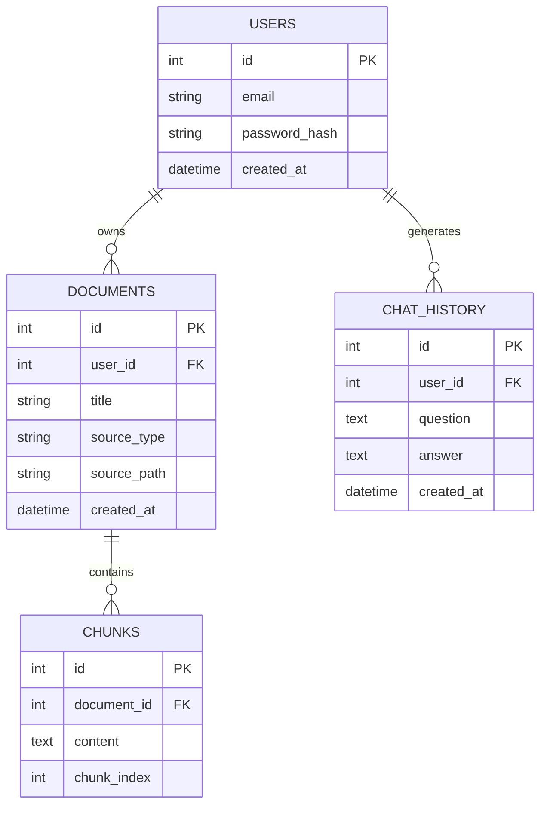

# 🚀 AI Knowledge Assistant

### Production-Ready RAG System with FastAPI, PostgreSQL, FAISS & Local LLM

---

## 🧠 Overview

This project is a **production-style AI backend system** that implements a **Retrieval-Augmented Generation (RAG)** pipeline using open-source tools.

It enables users to:

- 📄 Upload documents (PDF, text, etc.)
- 🌐 Ingest web content via scraping
- 🧠 Store and retrieve knowledge using vector embeddings
- 💬 Ask questions in natural language
- 🤖 Get accurate AI-generated answers using a local LLM
- 🔐 Authenticate securely using JWT

---

## 🏗️ Architecture

### 🔹 Design Approach

- **Clean Architecture**
- **Modular Monolith**

### 🔹 Layers

| Layer                | Responsibility           |
| -------------------- | ------------------------ |
| API Layer            | FastAPI routes           |
| Service Layer        | Business logic           |
| Domain Layer         | Models & schemas         |
| Infrastructure Layer | DB, FAISS, LLM, scraping |

---

## 🔄 RAG Pipeline Flow

```
User Query
   ↓
Embedding (sentence-transformers)
   ↓
FAISS Vector Search
   ↓
Relevant Chunks Retrieved
   ↓
LLM (Ollama / LM Studio)
   ↓
Generated Answer
```

---

## 🗄️ Database Design (ERD)



---

### 🧠 Design Notes

- A **user** can upload multiple documents
- Each document is split into **chunks for embedding**
- Chat history is stored for **tracking and future context**

---

## 🧱 Tech Stack

| Layer            | Technology            |
| ---------------- | --------------------- |
| Backend API      | FastAPI               |
| Database         | PostgreSQL            |
| ORM              | SQLAlchemy            |
| Vector Database  | FAISS                 |
| Embeddings       | sentence-transformers |
| LLM              | Ollama / LM Studio    |
| AI Orchestration | LangChain             |
| Web Scraping     | BeautifulSoup         |
| Authentication   | JWT                   |

---

## 🔐 Features

### ✅ Implemented

- FastAPI project structure
- Clean architecture setup
- GitHub workflow

### 🚧 In Progress

- PostgreSQL integration
- JWT authentication
- Document ingestion
- Web scraping module
- FAISS vector database
- RAG pipeline
- Chat system

---

## 📁 Project Structure

```
app/
├── api/              # FastAPI routes
├── core/             # Config & security
├── models/           # SQLAlchemy models
├── schemas/          # Pydantic schemas
├── db/               # Database connection
├── services/         # Business logic
├── rag/              # RAG pipeline
├── vectorstore/      # FAISS handling
├── scraping/         # Web scraping
├── dependencies/     # Auth dependencies
└── main.py
```

---

## ⚙️ Setup

### 1. Clone Repository

```bash
git clone https://github.com/Matt1tech/ai-rag-fastapi.git
cd ai-rag-fastapi
```

---

### 2. Create Virtual Environment

```bash
python -m venv venv
```

---

### 3. Activate Environment

```bash
# Windows
venv\Scripts\activate

# Mac/Linux
source venv/bin/activate
```

---

### 4. Install Dependencies

```bash
pip install fastapi uvicorn
```

---

### 5. Run Server

```bash
uvicorn app.main:app --reload
```

---

### 6. Access API Docs

```
http://127.0.0.1:8000/docs
```

---

## 🌿 Git Workflow

We follow a **feature-based development workflow**:

### Branches

- `main` → production-ready
- `dev` → integration branch
- `feature/*` → feature development

### Example

```
feature/auth-system
feature/rag-pipeline
feature/web-scraping
```

---

## 🧠 Key Concepts Demonstrated

- Clean Architecture principles
- RAG (Retrieval-Augmented Generation)
- Vector search using FAISS
- Local LLM integration
- REST API design
- Authentication with JWT
- Modular backend structure

---

## 🎯 Goals

- Build a **real-world AI backend system**
- Learn FastAPI at production level
- Understand vector databases and embeddings
- Apply scalable backend architecture
- Prepare for AI/backend engineering roles

---

## 📈 Future Improvements

- Docker containerization
- CI/CD pipeline
- Redis caching
- Async background workers
- Microservices architecture
- Frontend (React dashboard)

---

## 👨‍💻 Author

**Mohamad Albukaai**

---

## 📜 License

MIT License

---

## ⭐ Final Note

This project is designed as a **first public project of my portfolio-level system**, demonstrating both:

- My backend engineering skills
- Practical AI system implementation

---
